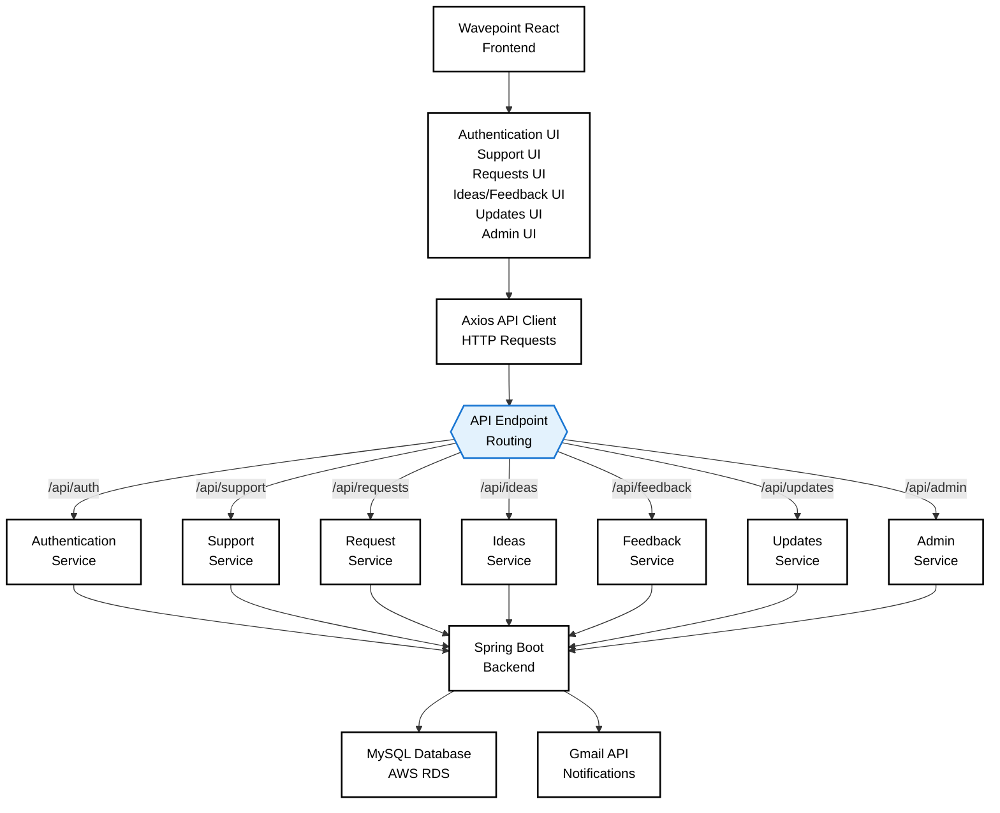

# Customer Support Frontend : WavePoint 
---

## Overview

**Wavepoint Support Frontend** is a modern, responsive React application providing the customer-facing interface for the Wavepoint Customer Support Portal. Built with React 19, Vite, and TailwindCSS, it enables users and administrators to interact seamlessly with the Wavepoint support ecosystem.

### Core Features

- **Authentication** : Secure login, registration, and password reset workflows
- **Support Requests** : Submit and track customer support issues
- **Request Tracking** : View and manage submitted support requests
- **Feedback Collection** : Share product feedback and ratings
- **Ideas & Suggestions** : Submit and view product feature ideas
- **Product Updates** : Browse feature releases and announcements
- **FAQs & Assistance** : Self-service knowledge base
- **WaveBot** : AI-powered intelligent support assistant
- **Admin Dashboard** : Manage updates and administrative features
- **Responsive Design** : Mobile-first, fully responsive UI
- **Real-time API Integration** : Seamless backend communication with Axios
- **Modern Styling** : Clean, professional UI with TailwindCSS

---

## Live Application

**Production:** https://wave-point-support.vercel.app

---

## Technology Stack

| Component | Technology |
|-----------|-----------|
| **Framework** | React 19 |
| **Build Tool** | Vite 8 |
| **Language** | JavaScript/TypeScript |
| **Styling** | TailwindCSS 3.x |
| **Routing** | React Router 7 |
| **HTTP Client** | Axios |
| **State Management** | React Context / Local State |
| **Deployment** | Vercel |
| **Backend Integration** | REST API (Spring Boot) |

---

## Architecture

The frontend implements a **component-driven, route-based architecture** with clear separation between the presentation layer (React components) and the API communication layer (Axios).

### Full System Integration



### Component Structure

The frontend organizes components hierarchically:

```
src/
├── App.jsx              # Root component
├── main.jsx             # Entry point
├── index.css            # Global styles
│
├── components/          # Reusable components
│   ├── Navbar.jsx
│   ├── Footer.jsx
│   ├── Button.jsx
│   ├── Card.jsx
│   ├── Modal.jsx
│   ├── Loader.jsx
│   └── ErrorBoundary.jsx
│
├── pages/               # Route pages
│   ├── Login.jsx
│   ├── Register.jsx
│   ├── Dashboard.jsx
│   ├── Support.jsx
│   ├── MyRequests.jsx
│   ├── Feedback.jsx
│   ├── Ideas.jsx
│   ├── Updates.jsx
│   ├── FAQs.jsx
│   ├── WaveBot.jsx
│   ├── AdminPanel.jsx
│   └── NotFound.jsx
│
├── services/            # API communication
│   ├── api.js           # Axios instance
│   ├── authService.js
│   ├── supportService.js
│   ├── requestService.js
│   ├── feedbackService.js
│   ├── ideasService.js
│   ├── updateService.js
│   └── adminService.js
│
├── hooks/               # Custom React hooks
│   ├── useAuth.js
│   ├── useFetch.js
│   ├── useForm.js
│   └── useNotification.js
│
├── context/             # React Context
│   ├── AuthContext.jsx
│   └── NotificationContext.jsx
│
├── utils/               # Utility functions
│   ├── validators.js
│   ├── formatters.js
│   ├── localStorage.js
│   └── constants.js
│
├── styles/              # TailwindCSS & themes
│   ├── tailwind.config.js
│   ├── global.css
│   └── animations.css
│
└── assets/              # Images, icons
    ├── logo.png
    ├── icons/
    └── illustrations/
```

---

## Getting Started

### Prerequisites

- Node.js 18.x or higher
- npm or yarn package manager
- Git for version control

### Installation

1. **Clone the repository**
   ```bash
   git clone https://github.com/Y-K-SAI-SRIKAR/WavePoint-Support.git
   cd WavePoint-Support
   ```

2. **Install dependencies**
   ```bash
   npm install
   # or
   yarn install
   ```

3. **Start the development server**
   ```bash
   npm run dev
   # or
   yarn dev
   ```

   The application will be available at:
   ```
   http://localhost:5173
   ```

### Build for Production

```bash
npm run build
# or
yarn build
```

The optimized production build will be created in the `dist/` directory.

### Preview Production Build

```bash
npm run preview
```

---

## Project Structure

### Configuration Files

- **`vite.config.js`** : Vite build and dev server configuration
- **`tailwind.config.js`** : TailwindCSS theme and plugin configuration
- **`.env.local`** : Environment variables (not committed)
- **`package.json`**: Project metadata and dependencies

### Source Structure

```
src/
├── pages/              # Page components for routes
├── components/         # Reusable UI components
├── services/           # API service layer
├── hooks/              # Custom React hooks
├── context/            # React Context providers
├── utils/              # Utility functions
├── styles/             # Global styles
└── assets/             # Static assets
```

---

## API Integration

### Axios Configuration

The application uses Axios for HTTP communication with the Spring Boot backend.

**`src/services/api.js`**

```javascript
import axios from 'axios';

const API_BASE_URL = import.meta.env.VITE_API_BASE_URL || 'http://localhost:8080/api';

const api = axios.create({
  baseURL: API_BASE_URL,
  timeout: 10000,
  headers: {
    'Content-Type': 'application/json',
  },
});

// Add JWT token to all requests
api.interceptors.request.use((config) => {
  const token = localStorage.getItem('authToken');
  if (token) {
    config.headers.Authorization = `Bearer ${token}`;
  }
  return config;
});

// Handle errors globally
api.interceptors.response.use(
  (response) => response,
  (error) => {
    if (error.response?.status === 401) {
      // Handle unauthorized - redirect to login
      localStorage.removeItem('authToken');
      window.location.href = '/login';
    }
    return Promise.reject(error);
  }
);

export default api;
```

### API Endpoints

| Endpoint | Method | Purpose |
|----------|--------|---------|
| `/api/auth/login` | POST | User authentication |
| `/api/auth/register` | POST | User registration |
| `/api/auth/reset-password` | POST | Password reset |
| `/api/support/request` | POST | Create support request |
| `/api/support/requests` | GET | Fetch support requests |
| `/api/feedback` | POST | Submit feedback |
| `/api/ideas` | POST | Submit product idea |
| `/api/updates` | GET | Fetch product updates |
| `/api/admin/updates` | POST | Create update (admin) |

---

## Authentication

### Authentication Flow

1. User enters credentials on login page
2. Frontend sends POST request to `/api/auth/login`
3. Backend validates and returns JWT token
4. Frontend stores token in `localStorage`
5. Axios interceptor adds token to subsequent requests
6. Protected routes check for valid token

---

## Styling with TailwindCSS

The application uses TailwindCSS for utility-first styling and custom components.

### TailwindCSS Configuration

**`tailwind.config.js`**

```javascript
export default {
  content: [
    "./index.html",
    "./src/**/*.{js,jsx}",
  ],
  theme: {
    extend: {
      colors: {
        primary: '#1976d2',
        secondary: '#f50057',
      },
      fontFamily: {
        sans: ['Inter', 'sans-serif'],
      },
    },
  },
  plugins: [],
}
```

### Component Styling Examples

```jsx
// Button component with TailwindCSS
function Button({ children, variant = 'primary', ...props }) {
  const baseStyles = 'px-4 py-2 rounded font-semibold transition';
  const variants = {
    primary: 'bg-blue-600 text-white hover:bg-blue-700',
    secondary: 'bg-gray-200 text-gray-800 hover:bg-gray-300',
    danger: 'bg-red-600 text-white hover:bg-red-700',
  };
  
  return (
    <button className={`${baseStyles} ${variants[variant]}`} {...props}>
      {children}
    </button>
  );
}
```
---

## Development Guidelines

### Code Organization

- **Components** → Reusable UI elements
- **Pages** → Route-level components
- **Services** → API communication
- **Hooks** → Shared logic
- **Utils** → Helper functions

### Best Practices

- Use functional components with hooks
- Keep components small and focused
- Implement error handling for API calls
- Use React Context for global state
- Follow TailwindCSS naming conventions
- Add prop validation with PropTypes or TypeScript

### Testing

```bash
# Run tests
npm run test

# Run tests with coverage
npm run test:coverage

# Watch mode
npm run test:watch
```

---

## Deployment

### Vercel Deployment

The application is automatically deployed to Vercel from the GitHub repository.

1. **Connect Repository**
   - Push code to GitHub
   - Connect repository to Vercel dashboard

2. **Environment Variables**
   - Set `VITE_API_BASE_URL` in Vercel settings
   - Set `VITE_ENVIRONMENT=production`

3. **Build Settings**
   - Build command: `npm run build`
   - Output directory: `dist`

4. **Automatic Deployments**
   - Push to `main` branch triggers deployment
   - Preview deployments for pull requests

### Manual Build & Deploy

```bash
# Build production bundle
npm run build

# Test production build locally
npm run preview

# Deploy to Vercel CLI
vercel --prod
```
---

## Security Best Practices

### Do's 

- Store tokens securely in localStorage (or httpOnly cookies)
- Validate input on client-side
- Sanitize user-generated content
- Use HTTPS in production
- Implement CORS properly
- Validate JWT tokens before using
- Keep dependencies updated
- Use environment variables for API URLs

### Don'ts 

- Never expose API secrets in frontend code
- Don't log sensitive data
- Don't store passwords in frontend
- Don't use unreliable state management
- Don't skip input validation
- Don't hardcode API endpoints
- Don't commit `.env.local` to Git
- Don't trust client-side validation alone

---

## API Consumer

This frontend consumes the **Wavepoint Support Backend** REST API.

### Backend Repository

```
GitHub: https://github.com/Y-K-SAI-SRIKAR/CustSupportBackend
Deployment: Render
```

### Communication Contract

The frontend communicates with the backend through:

- **Protocol:** HTTPS REST API
- **Data Format:** JSON
- **Authentication:** JWT Bearer tokens
- **Headers:** Content-Type: application/json, Authorization: Bearer {token}

### API Base URL Configuration

```javascript
// Development
VITE_API_BASE_URL=http://localhost:8080/api

// Production
VITE_API_BASE_URL=https://api.wavepoint.com/api
```

---

## Dependencies

### Core Dependencies

```json
{
  "react": "^19.0.0",
  "react-dom": "^19.0.0",
  "react-router-dom": "^7.0.0",
  "axios": "^1.7.x",
  "tailwindcss": "^3.x"
}
```

### Development Dependencies

```json
{
  "vite": "^8.0.0",
  "@vitejs/plugin-react": "^4.0.0",
  "@tailwindcss/forms": "^0.5.x",
  "autoprefixer": "^10.x"
}
```

### Update Dependencies

```bash
# Check for outdated packages
npm outdated

# Update all packages
npm update

# Update specific package
npm install axios@latest
```

---

## Troubleshooting

### API Connection Issues

```
Error: "Failed to connect to API"
Solution: Check VITE_API_BASE_URL environment variable
```

### CORS Errors

```
Error: "Access to XMLHttpRequest blocked by CORS policy"
Solution: Verify backend CORS settings allow frontend origin
```

### Token Expiration

```
Error: "401 Unauthorized"
Solution: Token expired. User needs to login again
```

### Build Errors

```bash
# Clear node_modules and reinstall
rm -rf node_modules
npm install
npm run build
```

---
## License

This project is licensed under the MIT License. see the [LICENSE](LICENSE) file for details.

---

## Repository Note

**This is the Frontend repository.** The LossLess Engine is a distributed system with multiple independent components:

| Component | Repository 
|-----------|-----------
| **Frontend** (you are here) | [WavePoint - Support](https://github.com/Y-K-SAI-SRIKAR/WavePoint-Support) 
| **Backend** | [WavePointBackend](https://github.com/Y-K-SAI-SRIKAR/CustSupportBackend) 
| **MicroService** | [WavePoint MicroService](https://github.com/Y-K-SAI-SRIKAR/CustSupMicroService) 

---

**Maintained by:** YERRAGUNTLA KAMESWARA SAI SRIKAR
**Last Updated:** September 13, 2026.